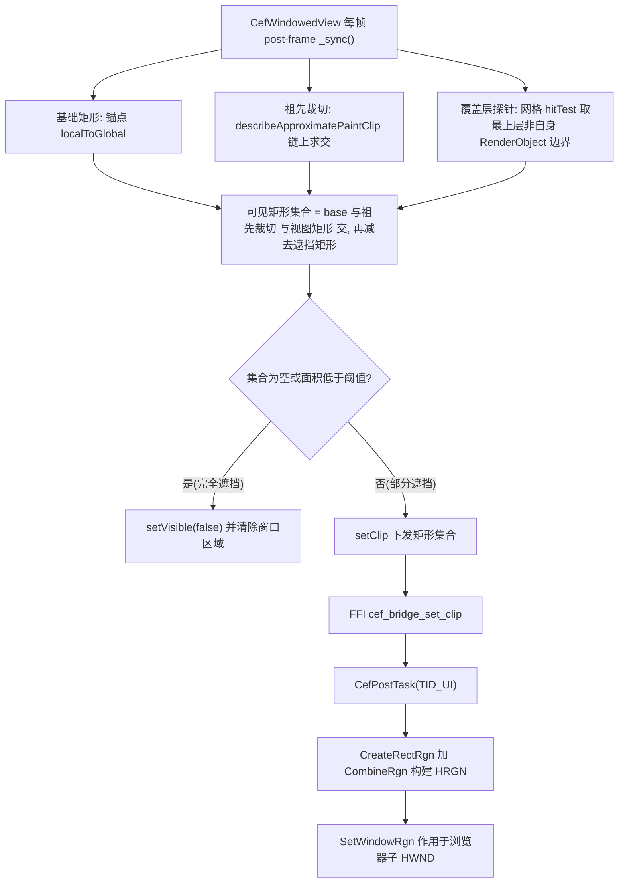

## 产品概述

为 Flutter Windows 桌面插件中由原生子窗口承载的 CEF 窗口化视图（slot 中的 CefWindowedView）增加「被遮挡时自动裁切」能力：当 Flutter 侧的弹窗、路由页、抽屉、遮罩、同级元素或滚动视口等覆盖该视图时，只呈现仍然可见的部分，被遮挡区域不再绘制、不再接收输入；完全遮挡时整块隐藏。

## 核心功能

- **遮挡自动检测**：框架每帧扫描渲染树与命中测试，自动识别覆盖槽位的元素（Dialog / Route / Drawer / 遮罩 / 同级遮挡 / 滚动溢出），无需页面显式登记。
- **裁切范围计算**：算出仍然可见的矩形集合，并区分「完全遮挡」与「部分遮挡」；可见面积低于阈值按完全遮挡处理。
- **裁切执行**：作用于原生窗口句柄层，只去掉不可见区域，不修改窗口尺寸与位置，因此网页保持运行、可交互，视口、布局与滚动位置完全不变。
- **实时更新**：跟随 Flutter 真实布局逐帧刷新；路由推入、抽屉滑出等动画期间连续收敛；布局静止时不产生任何跨语言调用。
- **边界与例外**：完全透明或不参与命中的覆盖忽略；系统弹窗、其它顶层窗口、CEF 自带右键菜单与输入法候选窗由系统处理；窗口最小化/失焦沿用现有隐藏逻辑；半透明遮罩默认按遮挡处理。
- **可观测与回退**：暴露遮挡状态回调（是否完全遮挡、可见矩形集合、当前是否启用裁切）；若个别合成环境下区域裁切不生效，可切换到几何逼近或整体隐藏。

## 视觉表现

被弹窗或抽屉覆盖时，网页像普通组件一样被「切掉」不可见部分，而不是浮在弹窗之上或整块消失；滚动时超出可视区域的部分被裁掉，不再溢出到相邻内容上；完全遮挡时底部占位块完整露出，恢复可见后网页原样回来（不重新加载、不跳动）。

## 技术栈选择

沿用现有工程栈，不引入任何新依赖：

- **Dart 侧**：Flutter 3.47 / Dart 3.13+，`dart:ffi` + `package:ffi`，纯 Dart 几何计算函数（可单测，无 IO）。
- **原生侧**：C++20 / Win32（CEF 150，Alloy runtime style，windowed rendering），继续使用 `CefPostTask(TID_UI)` + 互斥锁槽位表的既有线程模型。
- **复用的既有模式**：`cef_geometry.dart` 的纯函数 + const 阈值风格；`cef_ffi_bindings.dart` 的 `_XxxNative/_XxxDart` 成对 typedef + `lookupFunction`；`cef_bridge.h` 的纯 C ABI（不含 CEF 头文件）；`_sync()` 的 post-frame 每帧采样 + 阈值去重；`OnAfterCreated → CefBridgeApplyPendingState` 的延迟状态回放。

## 实现方案

### 总体策略

在 Dart 侧把「槽位矩形」收敛为「仍然可见的矩形集合」，把结果下发到原生侧，由原生在**浏览器子 HWND 句柄层**用窗口区域（`SetWindowRgn`）生效。整个链路分四步：

1. **基础矩形**：沿用现有 `GlobalKey` + `RenderBox.localToGlobal` 得到锚点全局逻辑矩形。
2. **祖先裁切（解决滚动/裁剪容器溢出）**：沿 `RenderObject.parent` 向上遍历，对每一层调用 `node.describeApproximatePaintClip(child)`，把返回的裁剪矩形（child 局部坐标）经 `child.getTransformTo(null)` + `MatrixUtils.transformRect` 换算到全局，逐层求交。`RenderViewport` / `RenderClipRect` / `RenderClipRRect` 等都会返回真实裁剪，因此滚动出视口的部分会被正确裁掉。
3. **覆盖层探针（解决弹窗/路由/同级遮挡）**：对槽位矩形做粗粒度网格采样（默认 5×5，共 25 点），每点调用 `RendererBinding.instance.renderView.hitTest(result, position: ...)`。`HitTestResult.path` 按绘制层叠顺序排列，`path.first` 是该点最上层命中对象：若它是锚点自身/其后代/其祖先链上的对象则该点未被遮挡；否则它就是遮挡者，取其 `RenderObject` 的全局矩形作为**精确遮挡矩形**（比网格量化更精确，网格只用于「发现谁在遮挡」）。
4. **区域求解**：`visibleRects = (base ∩ 祖先裁切 ∩ 视图矩形) − Σ 遮挡矩形`，做整像素量化与微小碎片合并。

随后按下发策略执行：集合为空或可见面积占比低于阈值（默认 1%）→ **完全遮挡**，隐藏窗口并清除区域；否则 → **部分遮挡**，把矩形集合直接下发，窗口尺寸/位置保持不变。

### 关键决策与取舍

- **句柄层裁切而非几何调整**：`SetWindowRgn` 只改变窗口的可绘制区域，网页视口、滚动位置、布局均不变，不触发 reflow 与页面跳动；代价是 Win32 region 为二值区域，无法与半透明遮罩混合，且个别硬件合成路径可能不生效 —— 因此提供 `CefClipMode { auto, region, geometry, hide }`，默认 `auto`，`geometry`（按可见包围盒调整窗口）与 `hide`（现状的「未完整可见即整体隐藏」）作为回退，保证旧行为可用。
- **命中测试探针而非渲染树不透明度分析**：`IgnorePointer` / `Offstage` / 完全透明（alpha == 0）的覆盖天然不参与命中，因此自动被忽略，与「不可见覆盖无需裁切」语义一致；同时用命中对象的真实边界而非网格单元，避免锯齿状裁切。
- **单一 ABI 表达三种状态**：`cef_bridge_set_clip(slot, rects, count)`，`count == 0` 表示完全遮挡（隐藏并清区域）；`count == 1` 且该矩形恰等于完整槽位时原生识别为「无裁切」并清除区域，从而无需额外的清除接口。
- **向后兼容**：`hideWhenClipped` 保留但降级为回退策略；新增 `clipOccluded`（默认 true）控制是否启用区域裁切。默认路径启用新行为，关闭后完全回到现状。

### 性能与可靠性

- 探针为 O(S²) 次命中测试（S = 每轴采样数，默认 5 → 25 次），单次成本与渲染树深度相关；加两条早退：锚点不在视图内或已被完全遮挡时跳过采样；`occlusionProbeInterval` 提供节流（默认每帧）。
- 复用单个 `HitTestResult`（`result.path.clear()`）避免每帧分配；矩形相减去重后遮挡者数量通常极小，复杂度可忽略。
- 跨 FFI 沿用阈值去重：矩形集合按 `kBoundsEpsilon` 比较，变化不足 1px 不下发；动画期间每帧至多一次下发，静止时零下发（与现有几何同步一致）。
- 原生侧 region 构建为 O(m)；当无遮挡时清除窗口区域以保持零开销；`SetWindowRgn` 成功后 region 所有权移交系统，禁止 `DeleteObject`。

## 实现注记

- **头文件约束**：`cef_bridge.h` 不得出现 CEF 类型，新增结构体只用 `int32_t`；插件薄壳以 `/W4 /WX` 编译，接口注释沿用现有 doc comment 风格。
- **坐标换算**：Dart 下发的是「相对 Flutter 视图客户区」的物理像素，HRGN 需要浏览器窗口自身坐标，故需减去槽位原点 `bounds.x / bounds.y`；CEF 的 `SetAsChild` 子窗口无边框，窗口坐标与客户区坐标一致，可加 `GetClientRect` vs `GetWindowRect` 保护分支。
- **既有回放路径自动生效**：裁切状态与 bounds/visible 一起存于 `BrowserSlot` 并在 `ApplyStateOnUiThread` 中统一应用，因此 `OnAfterCreated` 的回放路径无需改动，`cef_app.*` 与 `CMakeLists.txt` 无需修改。
- **绑定健壮性**：`CefNativeBindings.tryLoad()` 目前一次性 lookup 全部导出，新增导出后遇到旧 DLL 会导致整体降级为占位。建议把 `cef_bridge_set_clip` 作为**可选绑定**（缺失时 `clipSupported = false`，自动退回 `hideWhenClipped`），与现有「缺失即优雅降级」哲学一致。
- **日志**：沿用 `OutputDebugStringW`，仅在 region 创建失败 / `SetWindowRgn` 失败时输出，不进入每帧路径，避免刷屏。
- **影响面控制**：不改 runner、不改子进程宿主、不改 CEF 引导与关闭逻辑；新增代码全部落在 `cef_bridge.h/.cpp` 与 Dart 同步链路，风险局部化。
- **人工验证盲区**：`SetWindowRgn` 在 DirectComposition 加速呈现下的实际效果需在示例中真机确认；若出现裁切无效或残影，按 `CefClipMode.geometry` / `hide` 回退并在 README 记录。

## 架构设计



## 目录结构

```
webview_cef/
├── lib/
│   ├── webview_cef_floating.dart                 # [MODIFY] 公共 barrel：新增导出 CefClipMode / CefOcclusionState
│   └── src/
│       ├── widgets/
│       │   ├── cef_occlusion.dart                # [NEW] 遮挡检测与区域求解纯函数：collectAncestorClips、probeOccluders、subtractRects、quantizeRects、computeVisibleRects；全部无副作用、可直接单测
│       │   ├── cef_geometry.dart                 # [MODIFY] 补充区域相关常量（kOcclusionAreaThreshold、kProbeStride）与矩形集合工具（unionBounds / rectsDiffer）
│       │   └── cef_windowed_view.dart            # [MODIFY] _sync() 集成可见区域求解；新增 clipOccluded / clipMode / occlusionProbeStride / occlusionProbeInterval / occlusionAreaThreshold / onOcclusionChanged；完全遮挡走 hide，部分遮挡走 setClip；保留 hideWhenClipped 作为回退
│       └── native/
│           ├── cef_ffi_bindings.dart             # [MODIFY] 新增 CefBridgeRect 结构体与 cef_bridge_set_clip 的 typedef/lookup（按可选绑定处理，缺失时标记不支持）
│           └── cef_native_controller.dart        # [MODIFY] 新增 setClip({slot, rects})，空集合语义为完全遮挡，转发物理像素整数矩形
├── windows/cef/
│   ├── cef_bridge.h                              # [MODIFY] 新增纯 C 结构体 CefBridgeRect 与 cef_bridge_set_clip 声明（含 count == 0 语义注释）
│   └── cef_bridge.cpp                            # [MODIFY] BrowserSlot 增加 clip_rects/has_clip；新增 ApplyClipOnUiThread 或在 ApplyStateOnUiThread 内构建 HRGN 并 SetWindowRgn；无裁剪时清除区域，全遮挡时隐藏
├── test/src/widgets/
│   ├── cef_occlusion_test.dart                   # [NEW] 区域运算单测：矩形相减、祖先裁切求交、遮挡者去重、整像素量化、完全/部分遮挡判定、采样稀疏度
│   └── cef_windowed_view_test.dart               # [NEW] Widget 测试：叠加不透明面板时下发可见矩形集合；完全覆盖时下发空集合/隐藏
├── example/lib/
│   └── main.dart                                 # [MODIFY] 新增遮挡演示页：可拖动覆盖面板、半透明遮罩开关、完全遮挡场景；状态卡片展示 onOcclusionChanged 的可见矩形集合与是否为完全遮挡
└── README.md                                     # [MODIFY] 公开接口表格新增参数与回调；把「未做窗口区域裁剪」从遗留项移出，补充实现说明、裁切模式与例外清单
```

## 关键代码结构

原生纯 C ABI 新增（`windows/cef/cef_bridge.h`）：

```c
/// A rectangle in physical pixels, relative to the host window's client area.
typedef struct CefBridgeRect {
  int32_t x;
  int32_t y;
  int32_t width;
  int32_t height;
} CefBridgeRect;

/// Restricts the browser window of \p slot to the union of \p rects.
/// count == 0 means the browser is fully covered and is hidden with its window
/// region cleared. A single rect equal to the whole slot clears the region.
CEF_BRIDGE_API void cef_bridge_set_clip(int64_t slot,
                                        const CefBridgeRect* rects,
                                        int32_t count);
```

Dart 纯函数与公开参数（`lib/src/widgets/cef_occlusion.dart`、`cef_windowed_view.dart`）：

```
/// 从 [base] 中挖掉 [cutouts]，返回互不重叠、整像素对齐的矩形列表。
List<Rect> subtractRects(Rect base, Iterable<Rect> cutouts);

/// 沿祖先链累积 describeApproximatePaintClip，得到锚点的有效裁剪区域（全局坐标）。
Rect ancestorClipBounds(RenderObject anchor);

/// 网格命中测试，返回遮挡锚点的 RenderObject 全局矩形（已去重）。
List<Rect> probeOccluders(RenderObject anchor, Rect anchorGlobal, {int stride = 5});

/// 元素未命中视为未遮挡；可被上层命中但完全透明的覆盖不参与命中，自动忽略。
```

```
CefWindowedView(
  url: 'https://example.com',
  clipOccluded: true,                     // 启用区域裁切（默认）
  clipMode: CefClipMode.auto,             // auto / region / geometry / hide
  occlusionProbeStride: 5,                // 每轴采样点数
  occlusionAreaThreshold: 0.01,           // 低于该可见占比视为完全遮挡
  onOcclusionChanged: (CefOcclusionState s) { /* fullyOccluded, visibleRects */ },
);
```

## Agent Extensions

### Skill

- **dart-add-unit-test**
- Purpose: 为 `cef_occlusion.dart` / `cef_geometry.dart` 新增的区域运算与遮挡求解纯函数编写单元测试，覆盖矩形相减、祖先裁切求交、遮挡者去重、整像素量化与完全/部分遮挡判定。
- Expected outcome: 生成 `test/src/widgets/cef_occlusion_test.dart`，`flutter test` 全绿，关键边界（空集、全遮挡、多遮挡者重叠、亚像素抖动）均有断言。
- **flutter-add-widget-test**
- Purpose: 验证 `CefWindowedView` 在叠加不透明面板时下发「部分可见矩形集合」、被完全覆盖时下发空集合并隐藏。
- Expected outcome: 生成 `test/src/widgets/cef_windowed_view_test.dart`，通过可注入的控制器替身断言 `setClip` / `setVisible` 的调用与参数。
- **dart-run-static-analysis**
- Purpose: 落地完成后执行静态分析并修复机械性告警，保证新增 Dart 代码符合工程 lint 规则。
- Expected outcome: `flutter analyze` 无 error/warning，`dart fix --apply` 后代码风格与既有文件一致。