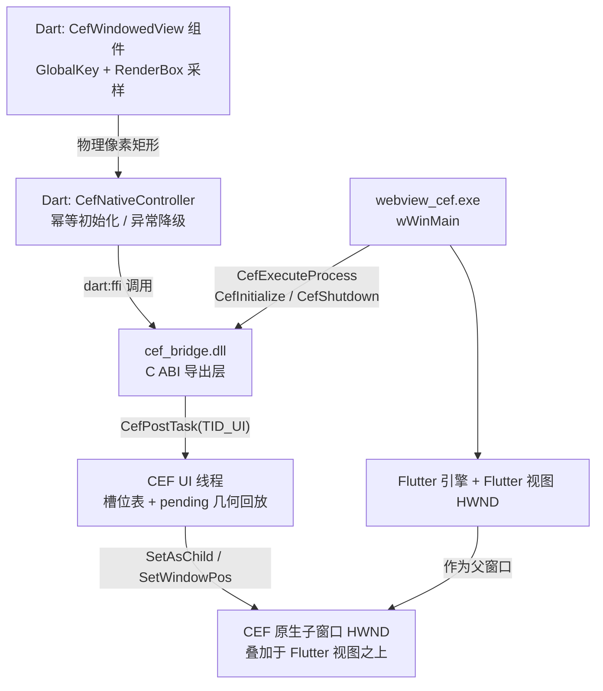

## 用户需求

在现有 Flutter Windows 工程（当前仅为 `Hello World` 标准模板）中集成 CEF，**不使用离屏渲染（OSR）**，而是采用**窗口化渲染（windowed rendering）**方案：CEF 创建一个真实的原生子窗口（HWND），以 `SetAsChild` 方式贴靠嵌入，叠加在 Flutter 窗口内容之上；该子窗口的位置与尺寸完全由 Dart 侧同步的几何信息驱动。

## 产品概述

工程名 `webview_cef`，目标是在 Flutter 桌面窗口内呈现一块由 CEF（Chromium 150）真实渲染的网页区域。该区域是一个独立的原生 Win32 子窗口，因此不受 Flutter 绘制管线约束：滚动流畅、可正常播放视频、输入法/右键菜单等原生行为完整。Flutter 侧通过一个占位组件声明"这里要放网页"，并把该区域在窗口中的实时矩形（物理像素）同步给原生层，原生层据此移动/缩放 CEF 子窗口。首期交付一个可运行的演示应用：可输入网址加载页面，并能通过按钮显示/隐藏该区域，用于直观验证贴合精度。

## 核心功能

- **CEF 运行时自动获取**：一键脚本下载官方 Windows x64 标准分发包（含 `libcef_dll_wrapper` 源码），校验 SHA1 后解压到工程内 `third_party/cef`，可重复执行、已存在则跳过。
- **CEF 进程引导与生命周期**：进程启动最早期完成子进程判定（CEF 的 renderer/GPU 子进程需立即退出，不得进入 Flutter 初始化）；主进程完成 CEF 初始化、配置缓存目录，并在应用退出时干净关闭。
- **窗口化浏览器子窗口**：以指定父窗口 + 矩形创建真正的子窗口浏览器，禁用离屏渲染，加载指定 URL。
- **Dart 驱动几何同步**：Dart 侧计算占位组件的逻辑矩形并换算为物理像素，跨 FFI 同步给原生层；原生层据此 `SetWindowPos` 移动/缩放子窗口。需覆盖滚动、窗口拖动、窗口缩放、DPI 变化等场景，做到始终精确贴合不偏移。
- **显示 / 隐藏控制**：可按需显示或隐藏子窗口；窗口最小化、Flutter 侧被全屏内容覆盖时自动隐藏，避免残留在最上层。
- **资源销毁**：组件销毁或应用退出时关闭浏览器、释放 CEF，确保无残留子进程。
- **演示界面**：地址输入 + 加载、显示/隐藏开关、实时几何信息展示区，以及可滚动内容用于验证几何跟随。

## 技术栈选型

- **宿主**：Flutter 3.47.0 stable / Dart 3.13.0，Windows 桌面 embedder（C++17，VS 2022）
- **原生**：C++17 + Win32 API + CEF **150.0.20+ga832838+chromium-150.0.7871.253**（standard distribution，含 `libcef_dll_wrapper`）
- **桥接**：独立 C ABI 动态库 `cef_bridge.dll` + Dart FFI（`dart:ffi` + `package:ffi` 做 Utf8 编解码）
- **构建**：CMake（由 `flutter build windows` 驱动）+ 新建 `cef_bridge` SHARED 目标
- **脚本**：PowerShell `windows/scripts/fetch_cef.ps1`；解压复用系统自带 `tar`（实测 bsdtar 3.8.1 支持 bz2，无需额外装 7-Zip）
- **CDN**：`https://cef-builds.spotifycdn.com/cef_binary_150.0.20+ga832838+chromium-150.0.7871.253_windows64.tar.bz2`（346,890,214 字节，SHA1 `110b46ecc46f1b45a7cc41f959de6ce5d9b2110a`）

## 实现方案

### 关键决策与理由

**1. 用独立 `cef_bridge.dll` 承载 CEF，而非把逻辑直接编进 exe。**
Dart FFI 必须加载一个动态库，而应用主体是 `webview_cef.exe`，把 exe 当 DLL 加载脆弱且非标准。因此把全部 CEF 逻辑编译成 `cef_bridge.dll`：exe 在 `wWinMain` 早期同步调用其引导函数（`CefExecuteProcess` / `CefInitialize`），Dart 用 FFI 加载同一个 DLL 做运行期控制。`cef_bridge.h` 为**纯 C ABI 且严禁包含任何 CEF 头文件**，这样 exe 仍可安全启用 `/W4 /WX`。

**2. 使用 `multi_threaded_message_loop = true`。**
Flutter 的 root isolate 运行在引擎 UI 线程，而 `wWinMain` 消息循环在进程主线程——FFI 调用天然发生在非主线程。开启多线程消息循环后 CEF 自建 UI 线程与消息泵，与 Flutter 消息循环彻底解耦；所有来自 Dart 的调用统一经 `CefPostTask(TID_UI, ...)` 投递，既满足 CEF 线程亲和性，又天然保证 FIFO 顺序（create 先于 setBounds 执行）。这是本方案的核心技术决策。

**3. 异步槽位模型。**
`create_browser` 在本线程立即分配并返回 `int64 slot`，不依赖跨线程返回值；浏览器在 `OnAfterCreated` 回调中回填到槽位映射表。创建完成前到达的几何/显隐请求写入 `pending`，在 `OnAfterCreated` 中回放——避免"bounds 早于窗口存在"导致丢失。

**4. 严格遵守窗口化渲染 API 语义。**
`CefWindowInfo::SetAsChild(parent_hwnd, rect)` + `CefSettings.windowless_rendering_enabled = false`；几何同步用 `SetWindowPos(browser->GetHost()->GetWindowHandle(), ...)` 配合 `NotifyMoveOrResizeStarted()`，**不使用 `WasResized()`（那是 OSR 专用 API）**。显式设置 `runtime_style = CEF_RUNTIME_STYLE_ALLOY` 规避新版 CEF 默认值歧义。

**5. 几何语义唯一化：物理像素 + 相对宿主客户区。**
Flutter 侧用 `GlobalKey` + `RenderBox.localToGlobal(Offset.zero)` 与 `size` 得到逻辑矩形，乘 `devicePixelRatio` 转为物理像素；宿主窗口取 **Flutter 视图 HWND**（其客户区原点即 Flutter 逻辑坐标原点），因此无需再做非客户区偏移换算。逻辑→物理的换算**只在 Dart 侧发生一次**，原生层不做二次换算。

**6. 首期 `no_sandbox = true`。**
避免引入 `cef_sandbox.lib` 链接与沙箱初始化链路，降低最小闭环复杂度；在 README 中明确标注为后续安全加固项。

### 性能与可靠性

- **几何同步零空转**：`addPersistentFrameCallback` 每帧只做一次轻量矩形读取与比较（O(1)），仅当变化超过 1px 阈值才触发一次 FFI 调用；静止时无任何跨语言开销，避免每帧 N 次调用造成卡帧。
- **不阻塞 UI 线程**：所有原生操作经 `CefPostTask` 异步投递，Dart 侧调用立即返回，杜绝 Flutter UI 线程被 `SetWindowPos` 等 Win32 调用阻塞。
- **查找复杂度**：槽位用 `std::unordered_map<int64_t, BrowserSlot>`，O(1) 查找，天然避免 N+1。
- **退出不挂死**：`cef_bridge_shutdown` 在投递关闭任务后以超时（约 5s）等待浏览器关闭完成，再于主线程调用 `CefShutdown`，防止个别 renderer 未退导致应用卡死。

## 实现要点（执行注意事项）

- **`/W4 /WX` 冲突**：`windows/CMakeLists.txt` 的 `APPLY_STANDARD_SETTINGS` 会对目标施加 `/W4 /WX` 与 `_HAS_EXCEPTIONS=0`。`cef_bridge` 目标**必须绕过该函数**，自行指定 `/std:c++17`、`/EHsc`、较低告警等级；同时 `cef_bridge.h` 不引入 CEF 头，使 runner exe 侧不受影响。
- **CMake 接法照抄官方范例**：`cef_bridge` 目标的链接方式应参照 CEF 自带 `tests/cefsimple/CMakeLists.txt`——`CMAKE_MODULE_PATH` 追加 `${CEF_ROOT}/cmake`、`include(cef_variables)`、`include(cef_macros)`、`add_subdirectory(${CEF_ROOT}/libcef_dll)`，并链接 `libcef_lib` 与 `libcef_dll_wrapper`，避免自行臆造目标名。
- **运行期文件必须齐备**：把 CEF `Release/`（Debug 配置取 `Debug/`）下的 `libcef.dll`、`chrome_elf.dll`、`*.pak`、`icudtl.dat`、`locales/`、`d3dcompiler_47.dll`、`libEGL.dll`、`libGLESv2.dll`、`vk_swiftshader.dll`、`vk_swiftshader_icd.json`、`vulkan-1.dll` 拷到 `build/windows/x64/runner/<Config>/`，并排除 `*.lib/*.pdb/*.exp`。同时补充 `install()` 规则，保证 `flutter build windows` 产物完整。
- **子进程引导顺序**：`CefExecuteProcess` 必须在 `AttachConsole` / `CoInitializeEx` / Flutter 初始化**之前**；返回值 `>= 0` 时立即 `return`，绝不能进入消息循环。
- **缓存目录**：CEF 100+ 要求 `root_cache_path` 可写，设为 `%LOCALAPPDATA%\webview_cef\cef_cache`，与 `cache_path` 一并设置。
- **宿主窗口 `WS_CLIPCHILDREN`**：CEF 要求父窗口具备该样式以免被父窗口绘制覆盖；若 Flutter 视图窗口未自带，则在其句柄可用后按需补充。
- **窗口化渲染固有边界**：原生子窗口恒定位于 Flutter 内容之上，不受 Flutter 裁剪/圆角/层级控制。当 Flutter 侧弹出全屏路由时子窗口仍会覆盖在最上层，必须依靠 Dart 侧主动隐藏——此行为需在 README 中如实说明，演示页通过"打开全屏覆盖层自动隐藏"按钮体现该约定。
- **工具链风险与降级**：CEF 150（Chromium 150）对 MSVC 工具集与 Windows SDK 版本有较高要求。实施第一步须先确认 VS2022 的 MSVC 工具集号与 SDK 版本；若不满足，将 `CEF_VERSION` 改为兼容的 stable 分支（备选实测可用：`144.0.34+g8fc21c8+chromium-144.0.7559.261`、`152.0.6+g708dc14+chromium-152.0.7977.83`），脚本与 CMake 均以单一变量驱动，降级只需改一行。
- **FFI 边界安全**：DLL 解析失败（非 Windows / 文件缺失）时抛出明确异常并降级为占位渲染，绝不让应用崩溃；所有 `Utf8` 分配的指针在使用后 `calloc.free`。

## 架构设计



## 目录结构

```
webview_cef/
├── .gitignore                                # [MODIFY] 忽略 third_party/cef/ 与构建产物，避免仓库被 300MB+ 依赖污染
├── pubspec.yaml                              # [MODIFY] 新增 ffi、path 依赖（dart:ffi 为 SDK 内置）
├── README.md                                 # [MODIFY] 补齐前置条件、CEF 获取步骤、构建运行方式、架构说明与窗口化渲染固有边界
├── lib/
│   ├── main.dart                             # [MODIFY] 替换 Hello World 为演示页：地址输入+加载、显示/隐藏、实时几何展示、可滚动区域验证几何跟随
│   └── src/
│       ├── native/
│       │   ├── cef_ffi_bindings.dart         # [NEW] dart:ffi 绑定：DLL 解析（resolvedExecutable 同目录优先，回退裸名）、函数指针签名、Utf8 编解码封装
│       │   └── cef_native_controller.dart    # [NEW] 高层控制器：initialize 幂等、createView/updateBounds/setVisible/loadUrl/dispose；非 Windows 或 DLL 缺失时安全降级并抛出明确异常
│       └── widgets/
│           └── cef_windowed_view.dart        # [NEW] 核心几何同步组件：首帧后创建浏览器；addPersistentFrameCallback 每帧采样矩形并 1px 去抖；监听滚动通知、didChangeMetrics（DPI/窗口变化）、didChangeAppLifecycleState（最小化隐藏）；dispose 时销毁浏览器
├── test/
│   └── cef_geometry_test.dart                # [NEW] 单元测试：逻辑矩形→物理像素换算、可视区域裁剪判定、去抖阈值逻辑，覆盖 DPR 非整数与零尺寸等边界
└── windows/
    ├── CMakeLists.txt                        # [MODIFY] 定义 CEF_ROOT 并校验存在（缺失时 FATAL_ERROR 提示先跑脚本）；追加 CEF cmake 模块路径与 libcef_dll 子目录；新增 CEF 运行期文件拷贝函数与 install 规则
    ├── scripts/
    │   └── fetch_cef.ps1                     # [NEW] 下载脚本：以 CEF_VERSION 变量驱动，下载到 _dist/ 并校验 SHA1，用系统 tar 解压到 third_party/cef；已存在且版本匹配则跳过；支持 -Force 重下
    └── runner/
        ├── CMakeLists.txt                    # [MODIFY] 新增 cef_bridge SHARED 目标（自身编译选项，绕过 apply_standard_settings）；链接 libcef_lib 与 libcef_dll_wrapper；exe 链接 cef_bridge 导入库并添加构建依赖；CEF 运行期文件 POST_BUILD 拷贝
        ├── main.cpp                          # [MODIFY] wWinMain 最早期插入 CefExecuteProcess 子进程判定；CoInitializeEx 后调用 cef_bridge_initialize；窗口创建后回传宿主 HWND；消息循环退出后调用 cef_bridge_shutdown
        ├── flutter_window.cpp/.h             # [MODIFY] OnCreate 中把 flutter view 的 HWND 通过 cef_bridge_set_host_window 交给桥接层；必要时为宿主窗口补充 WS_CLIPCHILDREN
        ├── win32_window.cpp/.h               # [MODIFY] 让 WM_SIZE / WM_ACTIVATE 对额外子窗口保持兼容，避免 CEF 子窗口被顶层尺寸逻辑误改
        ├── cef_bridge.h                      # [NEW] 纯 C ABI 契约声明，供 exe 引导与 Dart FFI 共用；严禁包含 CEF 头文件
        ├── cef_bridge.cpp                    # [NEW] C ABI 实现：槽位表、pending 几何缓存与回放、CefPostTask(TID_UI) 线程投递、关闭时超时等待
        ├── cef_app.h                         # [NEW] CefApp / CefClient / CefLifeSpanHandler / CefLoadHandler 声明
        └── cef_app.cpp                       # [NEW] 上述接口实现：OnAfterCreated 回填槽位并应用 pending 几何、OnBeforeClose 清理、窗口化渲染相关设置
```

## 关键代码结构

```c
// windows/runner/cef_bridge.h —— 纯 C ABI，exe 与 Dart FFI 共用的唯一契约
#ifndef RUNNER_CEF_BRIDGE_H_
#define RUNNER_CEF_BRIDGE_H_

#include <stdint.h>

#ifdef __cplusplus
extern "C" {
#endif

#if defined(CEF_BRIDGE_EXPORTS)
#define CEF_BRIDGE_API __declspec(dllexport)
#else
#define CEF_BRIDGE_API __declspec(dllimport)
#endif

// 进程引导。返回 >= 0 表示当前进程是 CEF 子进程，调用方须立即以该值退出。
CEF_BRIDGE_API int cef_bridge_execute_process(void* instance);

// 初始化 CEF（含 multi_threaded_message_loop）。仅可在进程主线程调用一次，成功返回 1。
CEF_BRIDGE_API int cef_bridge_initialize(void* instance, const char* cache_root_dir);

// 记录宿主窗口（Flutter 视图 HWND），作为浏览器子窗口的父窗口。
CEF_BRIDGE_API void cef_bridge_set_host_window(void* hwnd);

// 创建窗口化浏览器，立即返回本线程分配的槽位 id（> 0）。坐标为物理像素、相对宿主客户区。
CEF_BRIDGE_API int64_t cef_bridge_create_browser(
    int32_t x, int32_t y, int32_t width, int32_t height, const char* url);

// 以下操作均异步投递到 CEF UI 线程，保持 FIFO 顺序。
CEF_BRIDGE_API void cef_bridge_set_bounds(int64_t slot, int32_t x, int32_t y,
                                          int32_t width, int32_t height);
CEF_BRIDGE_API void cef_bridge_set_visible(int64_t slot, int32_t visible);
CEF_BRIDGE_API void cef_bridge_load_url(int64_t slot, const char* url);
CEF_BRIDGE_API void cef_bridge_destroy_browser(int64_t slot);

// 关闭全部浏览器并 CefShutdown。仅可在进程主线程调用，且须在消息循环退出之后。
CEF_BRIDGE_API void cef_bridge_shutdown(void);

// 版本自检字符串（静态存储，勿释放）。
CEF_BRIDGE_API const char* cef_bridge_version(void);

#ifdef __cplusplus
}
#endif
#endif  // RUNNER_CEF_BRIDGE_H_
```

## Agent Extensions

### SubAgent

- **code-explorer**
- Purpose: 在接入阶段核对两处易错事实——CEF 自带 `tests/cefsimple/CMakeLists.txt` 的官方链接目标名与模块路径写法，以及 Flutter Windows embedder 中获取 Flutter 视图 HWND 的确切 API（`FlutterViewController::view()->GetNativeWindow()`），避免臆造目标名或 API。
- Expected outcome: 输出可照抄的 CMake 接入片段与确认无误的宿主 HWND 获取代码路径，使构建配置一次写对，减少试错迭代。

### Skill

- **dart-add-unit-test**
- Purpose: 为 Dart 侧几何同步逻辑（逻辑矩形→物理像素换算、可视性判定、1px 去抖）编写单元测试。
- Expected outcome: `test/cef_geometry_test.dart` 覆盖 DPR 为 1.25/1.5/2.0、零尺寸、完全移出可视区等边界，保证贴合计算的正确性可回归验证。
- **dart-run-static-analysis**
- Purpose: 对新增 Dart 代码执行 `dart analyze` 并自动修复机械性 lint 问题。
- Expected outcome: Dart 侧零 analyzer 错误与告警，保证 FFI 类型签名与控制器代码质量达标。