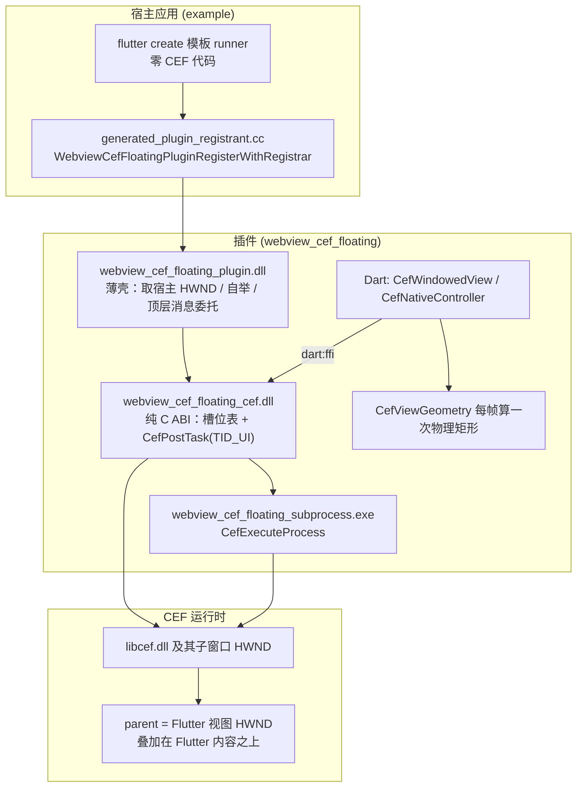

## 产品概述

将现有 `webview_cef` 工程中「在 Flutter Windows 桌面应用中嵌入 CEF（Chromium Embedded Framework）网页视图」的能力，整体重构为一个可复用的 Flutter 插件，插件名为 `webview_cef_floating`；原工程改造为插件本体，并新建 example 应用作为最小接入示例。

## 核心功能

- **插件对外 API**：以 `package:webview_cef_floating/...` 导出 `CefWindowedView`（网页占位与几何同步组件）、`CefViewGeometry`（几何快照）、`CefNativeController`（原生控制器），宿主仅需在 `pubspec.yaml` 中路径依赖插件并放置 `CefWindowedView` 即可嵌入网页。
- **宿主零改动接入**：宿主应用的 `windows/runner/**` 保持 `flutter create` 原始模板，不含任何 CEF 相关代码；CEF 的子进程判定、初始化、宿主窗口接管、关闭全部由插件自行完成，并额外提供独立子进程宿主程序。
- **CEF 二进制随插件分发**：CEF 下载脚本与 `third_party/cef` 归插件所有，宿主只需执行插件的脚本即完成 CEF 准备，无需自行配置 CEF 路径。
- **窗口化渲染能力保持**：网页由真实原生子窗口承载并叠加在 Flutter 内容之上，随滚动、窗口拖动/缩放、DPI 变化逐帧同步；区域未完整可见或需被 Flutter 覆盖层遮挡时自动/主动隐藏。
- **优雅降级**：非 Windows 平台、缺少原生库或 CEF 不可用时，插件不崩溃，页面降级为占位块渲染，原有几何换算单测继续可用。

## 视觉与交互效果

- 组件区域默认显示浅灰底、细边框的占位块，网页加载后由原生窗口精确覆盖该边框范围，边缘与 Flutter 布局严格贴合。
- 原有示例演示页保留并迁入插件 example：顶部地址栏 + 加载/刷新按钮、顶部开关控制网页显隐、滚动列表中的网页占位区域、几何信息卡片（桥接状态、版本、slot、可见性、逻辑/物理矩形、设备像素比），以及全屏覆盖层按钮（进入前自动隐藏网页）。

## 技术栈

- **Dart / Flutter**：Flutter 3.47.0 stable（Windows 桌面），Dart SDK `^3.13.0`
- **Dart 侧依赖**：`dart:ffi` + `package:ffi`（加载原生库、`Utf8` 转换）、`package:path`（解析可执行目录）；`flutter_lints ^6.0.0`
- **原生侧**：C++17（插件薄壳）+ C++20（CEF 实现库，CEF 150 要求）、Win32 API、CMake 3.14+、MSVC 2022
- **CEF**：`150.0.20+ga832838+chromium-150.0.7871.253` standard 分发包（含 `libcef_dll_wrapper` 源码），仅 x64

## 实现方案

### 总体策略

保持现有「窗口化渲染 + Dart FFI 驱动几何」的设计不变，仅做**包边界与自举责任**的搬迁：把「CEF 引导」从宿主 `wWinMain` 移交给插件的注册回调，把「CEF 运行时部署」从宿主 runner 的 CMake 移交给插件的 CMake，把演示页移入 example。这样既有实现（槽位表、`CefPostTask` FIFO、pending 几何回放、1px 阈值同步）零逻辑改动地复用。

### 关键决策与理由

1. **三个原生目标，分层编译**（沿用现有"CEF 独立库 + 薄壳"的成功结构）

- `webview_cef_floating_plugin`（插件薄壳 DLL）：仅包含 Flutter 插件头文件，走 `apply_standard_settings()` 的 `/W4 /WX /EHsc`，**不包含任何 CEF 头文件**，因此与 Flutter 工具链设置完全兼容。
- `webview_cef_floating_cef`（CEF 实现 DLL）：由 `cef_bridge.*` + `cef_app.*` 组成，走 `SET_LIBRARY_TARGET_PROPERTIES()`（`/std:c++20 /GR- _HAS_EXCEPTIONS=0`、`DELAYLOAD:libcef.dll`），只导出纯 C ABI。
- `webview_cef_floating_subprocess.exe`：CEF 子进程宿主。
- 理由：CEF 与 Flutter 的编译/链接设置互斥（`/EHsc` vs `/GR- _HAS_EXCEPTIONS=0`、`/WX` 与 CEF 头文件告警冲突），必须在独立 target 上隔离——这正是现有工程已验证的做法。

2. **用独立 helper.exe 取代 `wWinMain` 中的子进程判定**（实现"宿主零改动"的关键）

- 设置 `CefSettings.browser_subprocess_path = <exe目录>\webview_cef_floating_subprocess.exe`。该设置一旦非空，主进程 exe 就永远不会被 CEF 当作 renderer/gpu/utility 重启，因此 `main.cpp` 里的 `cef_bridge_execute_process` 不再是主进程必需步骤，宿主 `wWinMain` 可保持模板原样。
- helper.exe 极简：`wWinMain` → `CefMainArgs(GetModuleHandle(nullptr))` → `CefExecuteProcess(...)` → 返回退出码；用 `add_executable(... WIN32)` 避免控制台闪窗；仅链接 `libcef_dll_wrapper` 与 `CEF_STANDARD_LIBS`，无需 Flutter。
- 配合既有的 `multi_threaded_message_loop = true`，主进程无需泵 CEF 消息。

3. **初始化时机：插件注册回调（进程主线程）**

- Flutter 生成的 `FlutterWindow::OnCreate()` 在主线程同步调用 `RegisterPlugins(engine)`，而 `FlutterWindow::OnCreate()` 由 `wWinMain` 的 `window.Create(...)` 调用，故插件 `RegisterWithRegistrar` 运行在进程主线程 —— 满足 `CefInitialize` 的主线程要求。
- 保持现有的**饿汉式初始化**（与当前行为一致，避免引入额外的唤醒机制）；代价是启动时增加一次 CEF 初始化延迟，属已知取舍。

4. **宿主窗口零改动获取**

- 使用 `flutter::PluginRegistrarWindows::GetView()->GetNativeWindow()`（底层为 `FlutterDesktopPluginRegistrarGetView` + `FlutterDesktopViewGetHWND`），等价替换原 `flutter_window.cpp` 中的 `cef_bridge_set_host_window(flutter_view)`。
- 加一层兜底：若注册时 HWND 尚不可用，则通过 `RegisterTopLevelWindowProcDelegate` 在首个顶层窗口消息到达时再取一次并注册，随后注销委托。

5. **关闭时机零改动：顶层窗口过程委托 + atexit 兜底**

- 插件壳注册 `RegisterTopLevelWindowProcDelegate`，在 `WM_DESTROY` 时调用 `cef_bridge_shutdown()`——此时 HWND 仍有效，可先关闭全部浏览器再 `CefShutdown()`，这是**主路径**（标准 Flutter runner 的 `FlutterWindow::MessageHandler` 会转发到该委托）。
- `cef_bridge_initialize` 成功后额外注册 `std::atexit` 处理器调用同一个幂等的 `cef_bridge_shutdown()` 作为**兜底**；`DllMain(DLL_PROCESS_DETACH)` 只在 `lpReserved == nullptr`（进程终止而非 `FreeLibrary`）且未关闭时做最后一次尝试，避免在加载器锁内死锁。
- 理由：不改 `wWinMain` 就无法在消息循环退出后执行代码，`atexit` 在 `main` 返回后、DLL 卸载前执行，此时 `libcef.dll` 仍已加载。

6. **缓存目录按宿主可执行文件隔离**（重要修正）

- 现状写死 `%LOCALAPPDATA%\webview_cef\cef_cache`。作为插件被多个宿主应用同时使用时会因 CEF 的 `root_cache_path` 单例锁相互冲突导致第二个进程初始化失败。
- 新方案：由实现库内部推导 `%LOCALAPPDATA%\<宿主 exe 文件名>\cef_cache`（失败时回退到 exe 所在目录），保证每宿主唯一。

7. **纯 C ABI 保持稳定，仅两处收敛**

- 6 个浏览器驱动函数（`create_browser`/`set_bounds`/`set_visible`/`load_url`/`destroy_browser`/`set_host_window`）与 `version` **签名不变**，Dart FFI 绑定只改库名。
- `cef_bridge_initialize(void* instance, const char* cache_root_path)` 收敛为 `cef_bridge_initialize(void* instance)`：缓存路径与子进程路径都在实现库内部推导，插件壳不再携带任何 Win32 路径逻辑（Dart 侧从不调用该函数，无兼容性影响）。
- Dart 侧原生库重命名为 `webview_cef_floating_cef.dll`，避免与宿主可能自带的同名 `cef_bridge.dll` 冲突（`libraryName` 与 CMake 目标名同步修改）。

8. **运行时部署用显式全量复制目标**

- `libcef.dll`、`chrome_elf.dll`、`d3dcompiler_47.dll`、`dxil.dll`、`dxcompiler.dll`、`libEGL/libGLESv2/vk_swiftshader.dll`、`*.bin/*.json`、`*.pak`、`icudtl.dat` 与 `locales\`（目录）必须位于 exe 同目录。
- 采用 `add_custom_target(... ALL)` + `cmake -E copy_if_different`（文件）与 `cmake -E copy_directory`（`locales` 目录），目标是 `$<TARGET_FILE_DIR:${BINARY_NAME}>`（`BINARY_NAME` 在 app 顶层作用域已定义、可被子目录继承）。相比 `install(FILES ...)` 的优势：`PLUGIN_BUNDLED_LIBRARIES` 的 `install(FILES)` 无法处理目录，且 `INSTALL_BUNDLE_LIB_DIR` 在插件作用域不可见；`ALL` 目标每次构建都校正，文件被误删也能恢复。
- 插件薄壳 DLL、CEF 实现 DLL、helper exe 三个**文件**则通过 `set(webview_cef_floating_bundled_libraries <genex> PARENT_SCOPE)` 交给 app 顶层已有的 `install(FILES ...)` 安装到 bundle 目录（`generated_plugins.cmake` 已支持该变量）。

### 性能与可靠性

- **几何同步**：保持「每帧 `post-frame` 采样一次 + 变化超过 1px 才跨 FFI」的策略，静态布局零跨语言调用；`addPostFrameCallback` 自身不会触发新帧，空闲无开销。
- **槽位与并发**：保持互斥锁保护槽位表 + `CefPostTask(TID_UI)` FIFO 投递 + `OnAfterCreated` 回放 pending 几何；浏览器未创建完成前到达的几何/显隐请求不丢失。
- **关闭**：`cef_bridge_shutdown` 保持 5s 上限轮询等待 `OnBeforeClose`，`force_close` 跳过卸载脚本，避免被页面卡死；幂等（`g_initialized` 守卫）以支持"窗口销毁路径 + atexit 兜底"双触发。
- **构建**：`libcef_dll_wrapper` 首次编译仍是主要耗时（数百 TU），增量构建与现状一致；CEF 运行时文件用 `copy_if_different`，稳态构建仅做差异比较。

## 实现要点

- **禁止跨作用域添加自定义命令**：`COPY_FILES`/`add_custom_command(TARGET ...)` 只施加于插件目录内定义的 target，不要对 app 的 `${BINARY_NAME}` 施加（跨目录限制）。
- **CEF_ROOT 解析要能穿透 `.plugin_symlinks`**：`set(WEBVIEW_CEF_FLOATING_CEF_ROOT "${CMAKE_CURRENT_SOURCE_DIR}/../third_party/cef" CACHE PATH ...)`，并支持环境变量覆盖；仍保留 `IS_DIRECTORY` 检查与 "先运行 fetch_cef.ps1" 的 `FATAL_ERROR` 提示。
- **`find_package(CEF)` 前必须设定**：`PROJECT_ARCH=x86_64`、`USE_SANDBOX=OFF`、`CEF_RUNTIME_LIBRARY_FLAG=/MD`（与 Flutter runner 的动态 CRT 对齐），并把 `CEF_DIST_BINARY_DIR` 映射为非 Debug → Release（Flutter 的 Profile 配置在 CEF 分发中不存在）。
- **插件入口符号与头文件路径必须符合 Flutter 工具约定**，否则 `generated_plugin_registrant.cc` 链接失败：`windows/include/webview_cef_floating/webview_cef_floating_plugin_c_api.h` 导出 `WebviewCefFloatingPluginRegisterWithRegistrar`；`pubspec.yaml` 声明 `flutter.plugin.platforms.windows.pluginClass: WebviewCefFloatingPlugin`。
- **延迟加载与降级**：实现库保留 `EnsureLibCefLoaded()`（`LoadLibraryW("libcef.dll")` 探针），使 `libcef.dll` 缺失时返回失败而非结构化异常；`cef_bridge_initialize` 失败 → `create_browser` 返回 0 → Dart 侧 `CefNativeController.instance()` 为 null → 组件显示占位块，全链路不崩溃。
- **日志**：沿用 `OutputDebugStringW` 的既有风格，仅输出短消息（缓存目录创建失败、关闭超时），不打印 URL/页面内容等敏感或大体积数据。
- **回归控制**：不改动 `cef_geometry.dart` 的任何算法与常量；`CefWindowedView` 的状态机、生命周期观察者、可见性判定逻辑原样保留，改动仅限 import 与注释。
- **沙箱未启用（`no_sandbox = true`）** 属已知取舍：CEF 沙箱构建会把宿主变为由 `bootstrap.exe` 启动的 DLL，与 Flutter runner 布局不兼容；保留现状并在 README 中重申生产环境应做地址白名单或重新评估沙箱。

## 架构设计



- **分层**：Dart 表现层（`CefWindowedView` + 几何纯函数）→ Dart 控制器层（`CefNativeController` 单例 + FFI 绑定）→ 原生薄壳（Flutter 插件契约、宿主窗口与生命周期接管）→ 原生实现（CEF 槽位与浏览器生命周期）→ CEF。
- **数据流**：`Widget` 每帧采样 `RenderBox.localToGlobal & size` → 逻辑矩形 × `devicePixelRatio` → 物理矩形（仅此一处换算）→ `setBounds/setVisible` 经 FFI 改槽位表 → `CefPostTask(TID_UI)` 在 CEF UI 线程 `NotifyMoveOrResizeStarted` + `SetWindowPos`。
- **生命周期**：注册回调取宿主 HWND 并 `CefInitialize` → `CefWindowedView` 首次进入可见区域才 `createBrowser` → 组件销毁/滚出 `cacheExtent` 时 `destroyBrowser` → 顶层窗口 `WM_DESTROY`（主路径）或 `atexit`（兜底）执行幂等 `cef_bridge_shutdown`。
- **改动范围**：Dart 逻辑零改动（仅包名与库名）；原生改动集中在自举责任搬迁与部署规则迁移；`windows/runner/**` 与 `windows/flutter/**` 从插件中移除，由 example 自带。

## 目录结构

```
webview_cef/                              # 插件根（pubspec name = webview_cef_floating，目录名保持不变）
├── pubspec.yaml                          # [MODIFY] name 改为 webview_cef_floating；新增 flutter.plugin.platforms.windows.pluginClass: WebviewCefFloatingPlugin；保留 ffi/path 依赖与 publish_to: 'none'
├── analysis_options.yaml                 # [MODIFY] 增加 example/** 排除，避免插件与示例重复分析
├── README.md                             # [MODIFY] 重写为插件文档：宿主接入步骤、CEF 下载、固有限制、排查表、目录结构
├── .gitignore                            # [MODIFY] 保留 /third_party/cef/、/third_party/.cache/；补充 example 构建产物
├── lib/
│   ├── webview_cef_floating.dart         # [NEW] 公共 barrel：export src/widgets/cef_windowed_view.dart 与 src/native/cef_native_controller.dart（CefWindowedView / CefViewGeometry / CefNativeController）
│   ├── main.dart                         # [DELETE] 演示页迁往 example/lib/main.dart
│   └── src/
│       ├── native/cef_ffi_bindings.dart  # [MODIFY] libraryName 改为 'webview_cef_floating_cef.dll'；更新与 cef_bridge.h 的同步注释；其余加载/降级逻辑不变
│       ├── native/cef_native_controller.dart  # [MODIFY] 注释与命名对齐插件名，逻辑不变
│       └── widgets/
│           ├── cef_geometry.dart         # [KEEP] 纯函数与常量零改动
│           └── cef_windowed_view.dart    # [MODIFY] 仅 import 与注释；状态机、每帧采样、可见性判定原样保留
├── test/src/widgets/cef_geometry_test.dart  # [MODIFY] import 改为 package:webview_cef_floating/src/widgets/cef_geometry.dart
├── third_party/cef/                      # [KEEP] 位置不变，fetch_cef.ps1 的相对路径推导依旧成立
├── windows/
│   ├── CMakeLists.txt                    # [REWRITE] 插件 CMake：CEF_ROOT 解析（cache 变量 + 环境变量覆盖）、find_package(CEF)、libcef_dll_wrapper、三个原生目标、bundled_libraries、CEF 运行时部署 ALL 目标
│   ├── .gitignore                        # [MODIFY] 移除 flutter/ephemeral 条目（插件无此目录）
│   ├── include/webview_cef_floating/
│   │   └── webview_cef_floating_plugin_c_api.h  # [NEW] Flutter 插件 C API 声明，导出 WebviewCefFloatingPluginRegisterWithRegistrar
│   ├── webview_cef_floating_plugin.h/.cpp       # [NEW] 插件入口：创建插件实例与 MethodChannel 占位；注册回调中取宿主 HWND、调用 cef_bridge_initialize、注册顶层窗口过程委托；WM_DESTROY 时 cef_bridge_shutdown；CEF 不可用时静默降级
│   ├── webview_cef_floating_plugin_c_api.cpp    # [NEW] 薄封装：转发到 RegisterWithRegistrar 实现
│   ├── cef/
│   │   ├── cef_bridge.h                  # [MOVE from runner/] [MODIFY] 纯 C ABI；cef_bridge_initialize 去掉 cache_root_path 参数；补充自举/线程契约注释
│   │   ├── cef_bridge.cpp                # [MOVE from runner/] [MODIFY] 内部推导缓存目录（按宿主 exe 名）与子进程路径并写入 CefSettings.browser_subprocess_path；initialize 成功后注册 std::atexit 兜底；DllMain 进程终止兜底；版本串更名为 webview_cef_floating
│   ├── cef/cef_app.h / cef_app.cpp       # [MOVE from runner/] 按 slot 路由 OnAfterCreated / OnBeforeClose，逻辑不变
│   ├── subprocess/main.cpp               # [NEW] CEF 子进程宿主：CefMainArgs + CefExecuteProcess + 返回退出码
│   ├── scripts/fetch_cef.ps1             # [KEEP] 相对路径不变；仅更新结尾提示文案为“在 example 目录构建运行”
│   ├── runner/**                         # [DELETE] 应用专属 runner（main.cpp / flutter_window.* / win32_window.* / utils.* / Runner.rc / resource.h / manifest / resources / CMakeLists.txt）
│   └── flutter/**                        # [DELETE] 应用专属 Flutter CMake 脚手架与插件注册生成物（含 ephemeral）
└── example/
    ├── pubspec.yaml                      # [NEW] flutter create 生成；dependencies 增加 webview_cef_floating: { path: ../ }
    ├── lib/main.dart                     # [NEW] 迁移自原 lib/main.dart 的完整演示页（地址栏 / 显隐开关 / 几何信息卡片 / 全屏覆盖层 FAB），import 改为 package:webview_cef_floating/webview_cef_floating.dart
    ├── test/widget_test.dart             # [NEW] flutter create 默认模板，按需精简
    └── windows/                          # [NEW] flutter create --platforms=windows 生成；runner 保持模板原样（零 CEF 代码），generated_plugins.cmake 自动引入插件
```

## 关键代码结构

原生 ABI 是 Dart FFI 与两个原生目标共同依赖的唯一契约，签名收敛如下（其余函数保持不变）：

```c
// windows/cef/cef_bridge.h —— 纯 C ABI，禁止包含任何 CEF 头文件
// 仅供 CEF 子进程宿主使用，在 wWinMain 中最早调用；>=0 表示本进程是子进程，应立即返回该值
CEF_BRIDGE_API int cef_bridge_execute_process(void* instance);

// 以浏览器进程身份初始化 CEF，必须在进程主线程调用（插件注册回调满足该条件）。
// 缓存目录与 browser_subprocess_path 由实现内部按宿主 exe 推导，调用方不再传入路径。
// 返回 1 成功、0 失败；成功后注册 atexit 兜底关闭。
CEF_BRIDGE_API int cef_bridge_initialize(void* instance);

// 浏览器窗口的父窗口，通常是 Flutter 视图 HWND；内部自动补 WS_CLIPCHILDREN
CEF_BRIDGE_API void cef_bridge_set_host_window(void* hwnd);

// 幂等：关闭全部浏览器（最多等待 5s）后 CefShutdown；可由 WM_DESTROY 与 atexit 双路径触发
CEF_BRIDGE_API void cef_bridge_shutdown(void);
```

## Agent Extensions

### SubAgent

- **code-explorer**
- Purpose: 在编写插件 CMake 与原生入口前，核实本机 Flutter SDK 中 Windows 插件的脚手架约定（`pubspec.yaml` 的 `platforms.windows.pluginClass` 取值规则、`generated_plugin_registrant.cc` 期望的头文件路径与 `WebviewCefFloatingPluginRegisterWithRegistrar` 符号、`${plugin}_bundled_libraries` 变量的作用域要求、插件模板 `windows/CMakeLists.txt` 的目标名与链接项），避免凭记忆写出链接失败的脚手架。
- Expected outcome: 得到与本机 Flutter 版本一致的模板事实清单（模板文件路径 + 关键行），并据此确定插件 `windows/CMakeLists.txt`、`windows/include/webview_cef_floating/webview_cef_floating_plugin_c_api.h`、`webview_cef_floating_plugin.cpp` 的确切命名与结构。

### Skill

- **dart-run-static-analysis**
- Purpose: 重构后对插件 Dart 层执行静态分析并自动修复机械性 lint 问题（包名/import 变更后的残留引用、未使用导出等）。
- Expected outcome: `dart analyze` 在插件与 example 上零 error、零 warning，`dart fix --apply` 已应用的机械修复已落地。